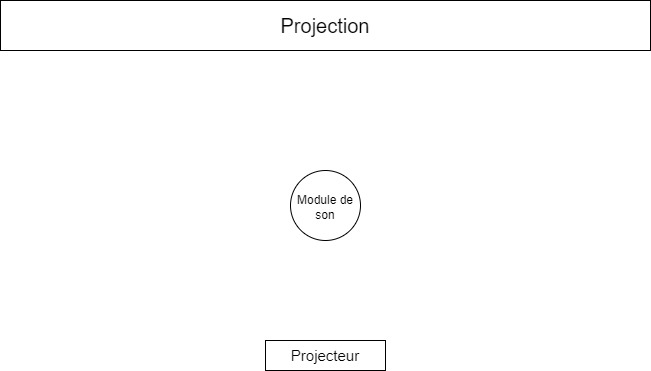

# La projection architecturale aussi dit projection mapping

## Qu'est-ce que c'est ?
La projection architecturale est la projection de contenus vidéos sur diverses surfaces ou formes. Il est nécessaire d'aligner les images sans distortion si on veut éviter de dévaloriser les éléments qui y sont projetés et ce, dans l'objectif de donner cette impression au public que ce qu'il voit est réel et bien devant eux. La particularité de cette technologie est qu'elle peut être adaptée à n'importe quel environnement architectural en leur offrant à tous une seconde fonction, soit créer un monde illusoire. 

-webp-big.webp)
> Source [MadMapper](https://madmapper.com/gallery/)

## D'où ça vient ?
En 1969, Disneyland ouvre les portes du manège *Haunted Mansion* qui présente plusieurs projections, notamment la tête désincarnée de Madame Leota ainsi que cinq bustes chantants nommés les *Grim Grinning Ghosts*. La réalisation a été faite par l'enregistrement des portraits des chanteurs ensuite projeter sur le buste de leurs visages. 

> Source [Lumen & Forge](https://lumenandforge.com/services/3d-projection-mapping/?gclid=Cj0KCQjw9fqnBhDSARIsAHlcQYR8GIv4qehdlqRLMeg4t5RGDI6ikQURm4x1adZ4McbIdHs1FyRJNgAaAj7jEALw_wcB)

En 1980, un dénommé Michael Naimark met au point une installation cinématographique immersive appellée *Displacements*. La création de cette oeuvre commence avec l'enregistrement de deux artistes dans un salon au moyen d'une caméra rotative qui est substituée par le projecteur. Il s'agit d'un mappage de projection rotatif. 

En 1991, Disney réapparaît dans l'histoire de cette technologie comme le premier a posséder un brevet de cette dernière qui s'intitule *Appareil et procédé de projection sur un objet tridimensionnel*. Il évoque un *système permettant de peindre numériquement une image sur « un objet tridimensionnel profilé »* [^1].

> Source [Lumen & Forge](https://lumenandforge.com/services/3d-projection-mapping/?gclid=Cj0KCQjw9fqnBhDSARIsAHlcQYR8GIv4qehdlqRLMeg4t5RGDI6ikQURm4x1adZ4McbIdHs1FyRJNgAaAj7jEALw_wcB)

En 1994, GE possède un premier brevet pour un *système et une méthode permettant de superposer avec précision des images de modèles informatiques dans un espace tridimensionnel à un objet physique correspondant dans l'espace physique* [^2]

> Source [Lumen & Forge](https://lumenandforge.com/services/3d-projection-mapping/?gclid=Cj0KCQjw9fqnBhDSARIsAHlcQYR8GIv4qehdlqRLMeg4t5RGDI6ikQURm4x1adZ4McbIdHs1FyRJNgAaAj7jEALw_wcB)

En 1998, Ramesh Raskar, Greg Welch, Henry Fuchs et Deepak Bandyopadhyay et al. de l'UNC Chapel Hill qui ont émis l'idée d'un monde où toutes les surfaces pourraient faire profil de projections. Il était question de faire l'expérience de la réalité augmentée depuis notre bureau et de remplacer l'écran d'ordinateur décrit comme petit. C'est dans le domaine universitaire que la cartographie par projection a commencé à s'étendre. 

> Source [Lumen & Forge](https://lumenandforge.com/services/3d-projection-mapping/?gclid=Cj0KCQjw9fqnBhDSARIsAHlcQYR8GIv4qehdlqRLMeg4t5RGDI6ikQURm4x1adZ4McbIdHs1FyRJNgAaAj7jEALw_wcB)

En 1999, John Underkoffler explique le concept de l'*I/O Bulb*, soit un projecteur couplé à une caméra.

En 2004, Raskar et al. étudie les projecteurs mobiles.

En 2005-2006, Oliver Bimber étudie la projection sur des peintures et l'utilisation de rideaux comme écrans de projection.

## Comment faire pour créer une projection architecturale ?

D'abord, on utilise un logiciel spécialisé pour mapper les coins du contenu vidéo choisi ou créé sur les surfaces. Ensuite, on « masque » véritablement les formes ainsi que les positions exactes des divers attributs du bâtiment ou de l'espace de projection par le biais de modèles d'opacité. 

La projection architecturale se divise en quatre grandes catégories :
- V'Jing (Performances visuelles en temps réel)
- Théâtral
- Statique/Interactif
- Vidéo

## Quel logiciel on utilise ?
Le logiciel MadMapper est assurément l'un des meilleurs logiciels utiisés dans la projection mapping. Voici ses principales caractéristiques [^3] : 

- Lecteur vidéo ultra-rapide
- Prise en charge de plusieurs projecteurs
- Prise en charge de l'entrée audio 
- Masquage de Bézier et déformation du maillage
- Scanner spatial et calibrage 3D
- Compagnon matériel MiniMad pour le mappage vidéo ou l'exportation de mappage lumineux

## Exemples de projets utilisant la projection architecturale 

> Source [MadMapper](https://madmapper.com/gallery/) 

> Source [MadMapper](https://madmapper.com/gallery/) 

> Source [MadMapper](https://madmapper.com/gallery/) 

> Source [MadMapper](https://madmapper.com/gallery/) 

> Source [MadMapper](https://madmapper.com/gallery/) 

> Source [MadMapper](https://madmapper.com/gallery/)

Lien vers le projet [Soissons en lumières de Moment Factory](https://momentfactory.com/work/all/all/soissons-en-lumieres)

> Source [Moment Factory](https://momentfactory.com/work/all/all/soissons-en-lumieres)

## Quel est le concept ?
Le projet consiste a amener le public à se lâcher prise en faisant leur propre composition sur un module produisant de la musique dans laquelle celle-ci se transforme en une composition audiovisuelle créée par des lasers et de la projection mapping. 

## Plan de l'espace

## Inspiration
Lien vers le projet [Infinity Room de Refik Anadol](https://refikanadol.com/works/infinity-room/)

> Source [Maff](https://www.maff.tv/watch/infinity-room)

Lien vers une autre inspiration présentant [*la forme du son*](https://www.youtube.com/watch?v=wvJAgrUBF4w) (0.45s)
> Source [YouTube](https://www.youtube.com/watch?v=wvJAgrUBF4w)

## Comment va-t-on incorporer cette technologie dans le projet ?
La technologie sera directement interreliée au module mentionné précédemment. En effet, le son produit par les utilisateurs sera représenté visuellement dans une projection mapping, c'est-à-dire que la projection va se modifier à chaque son émis pour donner lieu à une composition audiovisuelle.  

## Matériels requis
- Logiciel MadMapper
- Projecteur

## Quels seront les défis ?
Le plus grand défi sera probablement de s'adapter à l'environnement pour bien mapper la surface pour éviter toute distorsion dans la projection. Ainsi que d'utiliser MadMapper, un tout nouveau logiciel. 

### Sources 
[Lumen & Forge](https://lumenandforge.com/services/3d-projection-mapping/?gclid=Cj0KCQjw9fqnBhDSARIsAHlcQYR8GIv4qehdlqRLMeg4t5RGDI6ikQURm4x1adZ4McbIdHs1FyRJNgAaAj7jEALw_wcB)

[PMC](https://projection-mapping.org/the-history-of-projection-mapping/)

[Wikipedia](https://en.wikipedia.org/wiki/Projection_mapping#See_also)

[Showtech](https://www.showtechproductions.com/best-video-mapping-software-programs/)

[^1]: Citation tirée du site [Lumen & Forge](https://lumenandforge.com/services/3d-projection-mapping/?gclid=Cj0KCQjw9fqnBhDSARIsAHlcQYR8GIv4qehdlqRLMeg4t5RGDI6ikQURm4x1adZ4McbIdHs1FyRJNgAaAj7jEALw_wcB)

[^2]: Citation tirée du site [Lumen & Forge](https://lumenandforge.com/services/3d-projection-mapping/?gclid=Cj0KCQjw9fqnBhDSARIsAHlcQYR8GIv4qehdlqRLMeg4t5RGDI6ikQURm4x1adZ4McbIdHs1FyRJNgAaAj7jEALw_wcB)

[^3]: Informations copiées du site [Showtech](https://www.showtechproductions.com/best-video-mapping-software-programs/)
